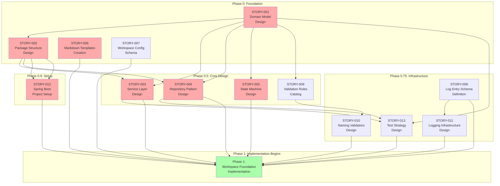
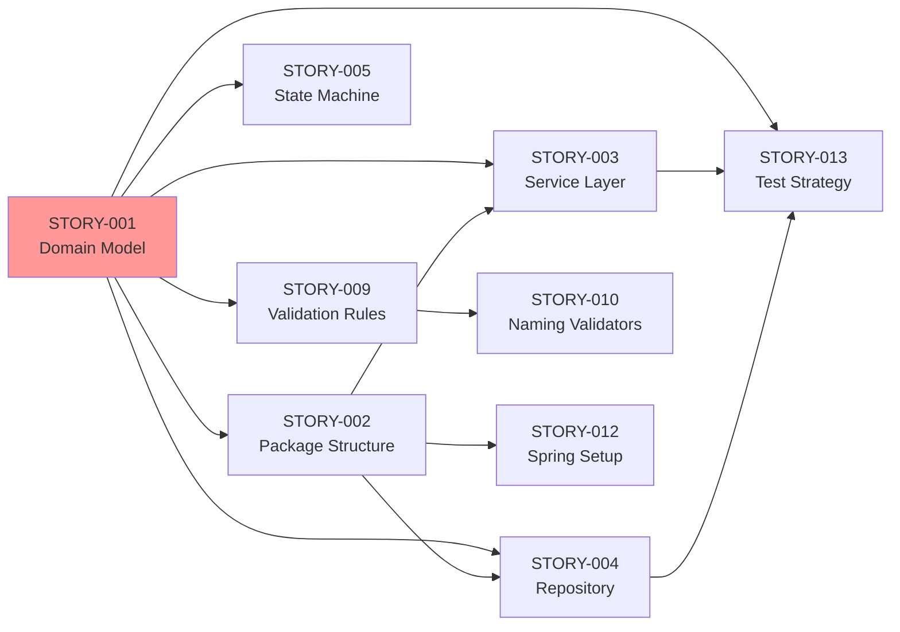

# Pre-Implementation Execution Plan

Visual roadmap for completing all design and planning work before implementation.

**Created**: 2026-03-30

---

## Execution Flow



---

## Story Priority Matrix

| Priority | Count | Stories |
|----------|-------|---------|
| 🔴 **Critical** | 6 | STORY-001, STORY-002, STORY-003, STORY-004, STORY-005, STORY-012 |
| 🟡 **High** | 7 | STORY-006, STORY-007, STORY-008, STORY-009, STORY-010, STORY-011, STORY-013 |

---

## Role Assignment Matrix

| Role | Story Assignments | Total |
|------|-------------------|-------|
| **logician** | STORY-001 (primary), STORY-005 (primary), STORY-008 (primary), STORY-010 (support) | 4 |
| **java-spring-architect** | STORY-002, STORY-003, STORY-004, STORY-011, STORY-012, STORY-001 (support), STORY-013 (support) | 7 |
| **markdown-template-designer** | STORY-006 | 1 |
| **workspace-initializer** | STORY-007 (primary) | 1 |
| **artifact-governance-lead** | STORY-007 (support), STORY-009 (support) | 2 |
| **file-contract-validator** | STORY-009 (primary), STORY-010 (primary) | 2 |
| **tester** | STORY-013 (primary) | 1 |
| **workflow-architect** | STORY-005 (support) | 1 |
| **coder** | (None in pre-implementation - will be primary for Phase 1+ implementation) | 0 |
| **documenter** | (Will document implementations in Phase 1+, can start on templates/README now) | 0 |

---

## Dependencies Graph



**Critical Path**: STORY-001 → STORY-002 → STORY-003/STORY-004 → STORY-012 → Implementation

---

## Effort Estimation

| Story | Effort | Role | Duration Est. |
|-------|--------|------|---------------|
| STORY-001 | Medium | logician | 4-6 hours |
| STORY-002 | Small | java-spring-architect | 2-3 hours |
| STORY-003 | Medium | java-spring-architect | 4-6 hours |
| STORY-004 | Medium | java-spring-architect | 4-6 hours |
| STORY-005 | Medium | logician | 4-6 hours |
| STORY-006 | Small | markdown-template-designer | 2-3 hours |
| STORY-007 | Small | workspace-initializer | 2-3 hours |
| STORY-008 | Small | logician | 2-3 hours |
| STORY-009 | Medium | file-contract-validator | 3-5 hours |
| STORY-010 | Small | file-contract-validator | 2-3 hours |
| STORY-011 | Medium | java-spring-architect | 4-6 hours |
| STORY-012 | Small | java-spring-architect | 1-2 hours |
| STORY-013 | Medium | tester | 4-6 hours |

**Total Estimated Effort**: 38-62 hours

---

## Phase Breakdown

### Phase 0: Foundation (Parallel Execution Possible)

```
┌─────────────────────────────────────────────────────────┐
│ STORY-001: Domain Model Design (4-6h)                  │
│ Role: logician                                          │
│ Blocking: Most other stories depend on this            │
└─────────────────────────────────────────────────────────┘
         │
         ├─────────────────────────────────────────────────┐
         │                                                  │
         ▼                                                  ▼
┌──────────────────────────┐                    ┌──────────────────────────┐
│ STORY-002: Package       │                    │ STORY-006: Markdown      │
│ Structure (2-3h)         │                    │ Templates (2-3h)         │
│ Role: java-spring-arch   │                    │ Role: md-template-design │
└──────────────────────────┘                    └──────────────────────────┘

                           ┌──────────────────────────┐
                           │ STORY-007: Workspace     │
                           │ Config Schema (2-3h)     │
                           │ Role: workspace-init     │
                           └──────────────────────────┘
```

**Parallel Execution**: STORY-001 must complete first, then STORY-002, STORY-006, STORY-007 can run in parallel.

---

### Phase 0.5: Core Design (Some Parallel Execution)

```
┌──────────────────────────┐     ┌──────────────────────────┐
│ STORY-003: Service       │     │ STORY-004: Repository    │
│ Layer (4-6h)             │     │ Pattern (4-6h)           │
│ Depends: 001, 002        │     │ Depends: 001, 002        │
└──────────────────────────┘     └──────────────────────────┘

┌──────────────────────────┐     ┌──────────────────────────┐
│ STORY-005: State Machine │     │ STORY-009: Validation    │
│ (4-6h)                   │     │ Rules (3-5h)             │
│ Depends: 001             │     │ Depends: 001             │
└──────────────────────────┘     └──────────────────────────┘
```

**Parallel Execution**: Once STORY-001 and STORY-002 complete, STORY-003, STORY-004, STORY-005, STORY-009 can run in parallel.

---

### Phase 0.75: Infrastructure (Some Parallel Execution)

```
┌──────────────────────────┐     ┌──────────────────────────┐
│ STORY-008: Log Entry     │     │ STORY-010: Naming        │
│ Schema (2-3h)            │     │ Validators (2-3h)        │
│ No dependencies          │     │ Depends: 009             │
└──────────────────────────┘     └──────────────────────────┘
         │
         ▼
┌──────────────────────────┐     ┌──────────────────────────┐
│ STORY-011: Logging       │     │ STORY-013: Test Strategy │
│ Infrastructure (4-6h)    │     │ (4-6h)                   │
│ Depends: 008             │     │ Depends: 001, 003, 004   │
└──────────────────────────┘     └──────────────────────────┘
```

---

### Phase 0.9: Setup (Final Step)

```
┌─────────────────────────────────────────────────────────┐
│ STORY-012: Spring Boot Project Setup (1-2h)            │
│ Depends: STORY-002 (package structure)                 │
│ Role: java-spring-architect                            │
│ OUTPUT: Runnable Spring Boot project skeleton          │
└─────────────────────────────────────────────────────────┘
```

---

## Optimal Execution Strategy

### Week 1: Foundation & Core Design

**Day 1-2**:
- [ ] STORY-001: Domain Model Design (blocking)

**Day 3**:
- [ ] STORY-002: Package Structure Design
- [ ] STORY-006: Markdown Templates (parallel)
- [ ] STORY-007: Workspace Config Schema (parallel)

**Day 4-5**:
- [ ] STORY-003: Service Layer Design
- [ ] STORY-004: Repository Pattern Design (parallel)
- [ ] STORY-005: State Machine Design (parallel)
- [ ] STORY-009: Validation Rules Catalog (parallel)

### Week 2: Infrastructure & Setup

**Day 6**:
- [ ] STORY-008: Log Entry Schema
- [ ] STORY-010: Naming Validators Design (after STORY-009)

**Day 7**:
- [ ] STORY-011: Logging Infrastructure
- [ ] STORY-013: Test Strategy Design (parallel)

**Day 8**:
- [ ] STORY-012: Spring Boot Project Setup
- [ ] Final review of all design artifacts

**Day 9**: Implementation Ready ✅

---

## Completion Criteria

All stories must meet these criteria before moving to implementation:

### For Design Stories
- [ ] Design documented in markdown
- [ ] Diagrams created (Mermaid, UML, etc.)
- [ ] Class/interface signatures defined
- [ ] Reviewed by at least one other role (reviewer)
- [ ] Approved by orchestrator

### For Template Stories
- [ ] Templates created with valid YAML
- [ ] Examples provided
- [ ] Validated against schema
- [ ] Documentation complete

### For Setup Stories
- [ ] Project builds successfully
- [ ] All dependencies resolve
- [ ] Can run Spring Boot application
- [ ] README updated

---

## Next Steps

1. ✅ **STORY-001**: Complete (domain model design by logician)
2. ⏭️ **STORY-002**: Package Structure Design (java-spring-architect)
3. ⏭️ **STORY-006**: Markdown Templates (markdown-template-designer) - can run in parallel
4. ⏭️ **STORY-007**: Workspace Config Schema (workspace-initializer) - can run in parallel

---

## Implementation Phase Assignments (Phase 1+)

When Phase 1 implementation begins, role assignments will be:

| Phase | Primary Role | Supporting Roles | Purpose |
|-------|-------------|------------------|---------|
| **Phase 1: Workspace Foundation** | **coder** | java-spring-architect (design reference), tester (testing) | Implement Java classes from STORY-001/002 designs |
| **Documentation** | **documenter** | coder (code to document) | JavaDocs, README, API docs |
| **Code Review** | **reviewer** | java-spring-architect (architecture compliance) | Review implementations |
| **Testing** | **tester** | coder (fix bugs) | Validate implementations |

---

## New Roles Added

### coder
- **Purpose**: Implement Java code from designs
- **Skills**: java-developer, java-spring-architect, domain-model-designer
- **Starts**: Phase 1 implementation (after all design stories complete)
- **Example work**: Implement Story.java, StoryService.java, StoryRepository.java

### documenter
- **Purpose**: Technical documentation (JavaDocs, API docs, README)
- **Skills**: technical-documentation-writer, java-spring-architect, markdown-template-designer
- **Starts**: Can start on README/templates now, JavaDocs during Phase 1
- **Example work**: JavaDoc comments, API reference, how-to guides

---

## Ready to Continue

STORY-001 complete. Ready to proceed with STORY-002, STORY-006, STORY-007 in parallel.