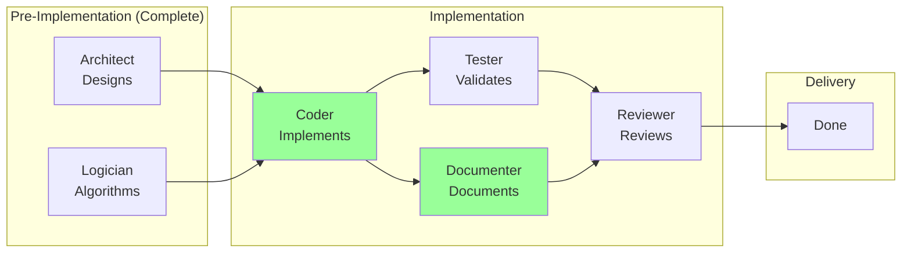

# Updated Execution Plan Summary

**Date**: 2026-03-30
**Status**: STORY-001 Complete, Gaps Resolved, Ready to Continue

---

## Current Status

```
✅ STORY-001: Domain Model Design (COMPLETE)
⏭️ STORY-002: Package Structure Design (READY)
⏭️ STORY-006: Markdown Templates (READY - can run parallel)
⏭️ STORY-007: Workspace Config Schema (READY - can run parallel)
```

---

## Complete Role & Skill Inventory

### 🎭 All Roles (10 Total)

| Role | Focus Area | Can Modify story.md? | Primary Phase |
|------|-----------|---------------------|---------------|
| **orchestrator** | Workflow coordination | ✅ Yes (only role) | All phases |
| **designer** | UX/UI design | ❌ No | All phases |
| **logician** | Formal logic, algorithms | ❌ No | Pre-implementation |
| **coder** | 🆕 General implementation | ❌ No | Implementation |
| **creative-writer** | Marketing, creative content | ❌ No | All phases |
| **artist** | Image generation | ❌ No | All phases |
| **tester** | Testing, QA | ❌ No | All phases |
| **reviewer** | Code/design review | ❌ No | All phases |
| **researcher** | Requirements, analysis | ❌ No | Pre-implementation |
| **documenter** | 🆕 Technical documentation | ❌ No (can modify reference/) | Implementation |

---

### 🛠️ All Skills (20 Total)

| Category | Skills | Focus |
|----------|--------|-------|
| **Architecture & Design** | java-spring-architect, domain-model-designer, workflow-architect | Design patterns, structure |
| **Implementation** | 🆕 java-developer | Writing actual code |
| **Documentation** | 🆕 technical-documentation-writer, markdown-template-designer | Technical docs, templates |
| **Validation** | file-contract-validator, workspace-initializer | File/structure validation |
| **Requirements** | requirements-manager, product-discovery | Gathering & refining |
| **Workflow** | story-lifecycle-manager, backlog-manager, sprint-planner | Work item management |
| **Governance** | artifact-governance-lead, role-definer, skill-creator | Standards & definitions |
| **Reporting** | status-reporter, visual-summary | Status & visualization |
| **UI** | ui-design-preview | UI design preview |
| **Process** | scrum-process-designer | Process design |

---

## Pre-Implementation Stories (13 Total)

### ✅ Phase 0: Foundation (1/4 Complete)

| Story | Role | Status | Artifact |
|-------|------|--------|----------|
| **STORY-001** | logician | ✅ Complete | domain-model-design__logician__2026-03-30T200000Z.md |
| **STORY-002** | java-spring-architect | 📋 Ready | - |
| **STORY-006** | markdown-template-designer | 📋 Ready | - |
| **STORY-007** | workspace-initializer | 📋 Ready | - |

**Progress**: ▓▓▓▓░░░░░░░░░░░░ 25%

---

### 📋 Phase 0.5: Core Design (0/4 Complete)

| Story | Role | Status | Dependencies |
|-------|------|--------|--------------|
| **STORY-003** | java-spring-architect | Blocked | STORY-001 ✅, STORY-002 |
| **STORY-004** | java-spring-architect | Blocked | STORY-001 ✅, STORY-002 |
| **STORY-005** | logician | Blocked | STORY-001 ✅ |
| **STORY-009** | file-contract-validator | Blocked | STORY-001 ✅ |

**Progress**: ░░░░░░░░░░░░░░░░ 0%

---

### 📋 Phase 0.75: Infrastructure (0/4 Complete)

| Story | Role | Status | Dependencies |
|-------|------|--------|--------------|
| **STORY-008** | logician | Ready | None |
| **STORY-010** | file-contract-validator | Blocked | STORY-009 |
| **STORY-011** | java-spring-architect | Blocked | STORY-008 |
| **STORY-013** | tester | Blocked | STORY-001 ✅, STORY-003, STORY-004 |

**Progress**: ░░░░░░░░░░░░░░░░ 0%

---

### 📋 Phase 0.9: Setup (0/1 Complete)

| Story | Role | Status | Dependencies |
|-------|------|--------|--------------|
| **STORY-012** | java-spring-architect | Blocked | STORY-002 |

**Progress**: ░░░░░░░░░░░░░░░░ 0%

---

## Implementation Phase Roles (Phase 1+)



---

## Phase 1 Implementation Example

**Story**: Implement Story Entity Class

| Step | Role | Artifact | Purpose |
|------|------|----------|---------|
| 1 | java-spring-architect | Design (STORY-001) | Reference for implementation |
| 2 | **coder** 🆕 | `Story__coder__timestamp.java` | Implement Story class |
| 3 | **coder** 🆕 | `StoryTest__coder__timestamp.java` | Write unit tests |
| 4 | **documenter** 🆕 | JavaDoc comments | Add documentation |
| 5 | tester | Test results | Validate implementation |
| 6 | reviewer | Review report | Code review |
| 7 | orchestrator | Update story.md | Mark complete |

---

## Gap Resolution Summary

| Gap | Before | After | Status |
|-----|--------|-------|--------|
| **Implementation** | Can design, can't code | coder + java-developer skill | ✅ Resolved |
| **Documentation** | Only creative writing | documenter + technical-documentation-writer | ✅ Resolved |
| **File Format Tracking** | Artifact had no format field | FileFormat enum added | ✅ Resolved |

---

## Total Progress

| Phase | Complete | Total | Progress |
|-------|----------|-------|----------|
| **Pre-Implementation** | 1 | 13 | ▓▓░░░░░░░░░░░░░░ 8% |
| **Implementation** | 0 | TBD | Not started |

**Overall**: Ready to continue with design phase

---

## Recommended Next Steps

### Option A: Sequential (Conservative)
1. STORY-002: Package Structure Design
2. Wait for approval
3. STORY-006: Markdown Templates
4. STORY-007: Workspace Config Schema

**Timeline**: 3-4 days

---

### Option B: Parallel (Aggressive) ⭐ RECOMMENDED

**Start Now** (no dependencies):
- STORY-002: Package Structure Design (java-spring-architect)
- STORY-006: Markdown Templates (markdown-template-designer)
- STORY-007: Workspace Config Schema (workspace-initializer)
- STORY-008: Log Entry Schema (logician)

**Timeline**: 1-2 days (parallel execution)

---

### Option C: Focus on Critical Path
1. STORY-002: Package Structure (blocks STORY-003, 004, 012)
2. STORY-003 + STORY-004 in parallel (blocked by 002)
3. STORY-012: Spring Boot Setup (blocked by 002)

**Timeline**: 2-3 days

---

## Files Created This Session

### New Roles
- `.agent/roles/coder/ROLE.md`
- `.agent/roles/documenter/ROLE.md`

### New Skills
- `.agent/skills/java-developer/SKILL.md`
- `.agent/skills/technical-documentation-writer/SKILL.md`

### Design Artifacts
- `requirements/temp-stories/artifacts/domain-model-design__logician__2026-03-30T200000Z.md`
- `requirements/temp-stories/comments/comment__logician__2026-03-30T200500Z.md`

### Analysis & Planning
- `requirements/temp-stories/ROLE-SKILL-GAP-ANALYSIS.md`
- `requirements/temp-stories/DOCUMENTER-VS-CREATIVE-WRITER-ANALYSIS.md`
- `requirements/temp-stories/ROLE-SKILL-UPDATES.md`
- `requirements/temp-stories/UPDATED-EXECUTION-SUMMARY.md` (this file)

---

## Ready to Proceed ✅

All gaps resolved. All roles and skills defined. STORY-001 complete.

**Awaiting decision**: Which execution option (A, B, or C)?