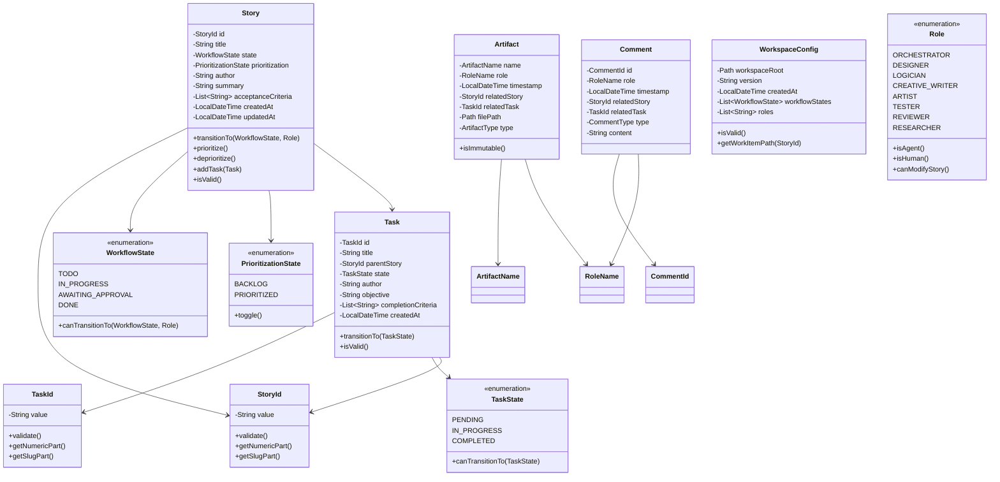

# Domain Model Design

**Artifact Type**: Design Document
**Role**: logician
**Timestamp**: 2026-03-30T20:00:00Z
**Related Story**: STORY-001
**Status**: Complete

---

## Overview

This document defines the complete domain model for the AI Work Management Platform using Domain-Driven Design principles. The domain layer is pure Java with no framework dependencies.

---

## Domain Model Architecture



---

## Entities

### Story (Aggregate Root)

**Responsibility**: Represents a unit of work in the system

**Fields**:
```java
public class Story {
    private final StoryId id;                           // Unique identifier
    private String title;                               // Required
    private WorkflowState state;                        // Current workflow state
    private PrioritizationState prioritization;         // Backlog or Prioritized
    private final String author;                        // Human curator (immutable after creation)
    private String summary;                             // One-sentence description
    private List<String> acceptanceCriteria;           // List of completion criteria

    // Optional fields
    private String priority;                            // high/medium/low or numeric
    private String parentEpic;                         // Epic reference (not enforced in Phase 1)
    private LocalDateTime createdAt;                   // ISO 8601
    private LocalDateTime updatedAt;                   // ISO 8601
    private Set<String> tags;                          // Classification tags
    private List<String> references;                   // External references
    private Path artifactPath;                         // Relative path to artifacts/
    private int taskCount;                             // Cached task count

    private List<Task> tasks;                          // Child tasks (aggregate)
}
```

**Invariants**:
- `id` must be valid StoryId format
- `title` must not be null or empty
- `state` must not be null
- `prioritization` must not be null
- `author` must not be null or empty
- `summary` must not be null or empty
- `acceptanceCriteria` must have at least one criterion
- State and directory location must be consistent (validated externally)

**Key Methods**:
```java
// State transition with role-based validation
public void transitionTo(WorkflowState newState, Role initiator) throws InvalidTransitionException

// Prioritization
public void prioritize()
public void deprioritize()

// Task management
public void addTask(Task task)
public void removeTask(TaskId taskId)
public Optional<Task> getTask(TaskId taskId)

// Validation
public boolean isValid()
public List<ValidationError> validate()
```

---

### Task (Entity within Story Aggregate)

**Responsibility**: Represents a sub-unit of work under a story

**Fields**:
```java
public class Task {
    private final TaskId id;                           // Unique identifier
    private String title;                              // Required
    private final StoryId parentStory;                 // Immutable reference to parent
    private TaskState state;                           // pending/in-progress/completed
    private final String author;                       // Human curator (immutable)
    private String objective;                          // What this accomplishes
    private List<String> completionCriteria;          // How to know it's done

    // Optional fields
    private LocalDateTime createdAt;
    private LocalDateTime updatedAt;
    private List<TaskId> dependencies;                // Other tasks this depends on
    private List<String> references;
    private Path artifactPath;                        // Relative path to artifacts/
}
```

**Invariants**:
- `id` must be valid TaskId format
- `title` must not be null or empty
- `parentStory` must not be null
- `state` must not be null
- `author` must not be null or empty
- `objective` must not be null or empty
- `completionCriteria` must have at least one criterion

**Key Methods**:
```java
public void transitionTo(TaskState newState) throws InvalidTransitionException
public boolean isValid()
public List<ValidationError> validate()
```

---

### Artifact (Entity - Read-Only)

**Responsibility**: Represents an immutable agent output file

**Fields**:
```java
public class Artifact {
    private final ArtifactName name;                   // Parsed filename
    private final RoleName role;                       // Role that created it
    private final LocalDateTime timestamp;             // UTC creation time
    private final StoryId relatedStory;               // Parent story
    private final TaskId relatedTask;                 // Optional parent task
    private final Path filePath;                      // Absolute path to file
    private final ArtifactType type;                  // research/analysis/mockup/etc
    private final FileFormat format;                  // File format/extension
    private final long sizeBytes;                     // File size
}
```

**Invariants**:
- `name` must follow pattern: `<desc>__<role>__<timestamp>.<ext>`
- `role` must be valid RoleName
- `timestamp` must be ISO 8601 UTC
- `relatedStory` must not be null
- `filePath` must exist on filesystem
- Artifacts are immutable after creation (no setters)

**Key Methods**:
```java
public boolean isImmutable()  // Always returns true
public String getDescriptiveName()
public String getExtension()
```

---

### Comment (Entity)

**Responsibility**: Represents an agent comment on a story or task

**Fields**:
```java
public class Comment {
    private final CommentId id;                       // UUID
    private final RoleName role;                      // Role that created it
    private final LocalDateTime timestamp;            // UTC creation time
    private final StoryId relatedStory;              // Parent story
    private final TaskId relatedTask;                // Optional parent task
    private final CommentType type;                  // status_update/question/suggestion/artifact_reference
    private final String content;                    // Markdown content
}
```

**Invariants**:
- `id` must not be null
- `role` must be valid RoleName
- `timestamp` must not be null
- `relatedStory` must not be null
- `type` must not be null
- `content` must not be null or empty

---

### WorkspaceConfig (Entity)

**Responsibility**: Represents workspace configuration

**Fields**:
```java
public class WorkspaceConfig {
    private final Path workspaceRoot;                 // Absolute path to workspace
    private final String version;                     // Workspace schema version
    private final LocalDateTime createdAt;
    private final List<WorkflowState> workflowStates; // Configured workflow states
    private final List<String> supportedRoles;        // Allowed role names
}
```

**Invariants**:
- `workspaceRoot` must exist and be writable
- `workspaceRoot` must be external to core project
- `version` must not be null
- `workflowStates` must contain at least: TODO, IN_PROGRESS, AWAITING_APPROVAL, DONE

---

## Value Objects

### StoryId

**Responsibility**: Type-safe story identifier

**Format**: `STORY-<numeric-id>-<slug>`

**Example**: `STORY-123-dashboard-ui`

```java
public record StoryId(String value) {
    public StoryId {
        if (!isValid(value)) {
            throw new IllegalArgumentException("Invalid story ID format: " + value);
        }
    }

    private static boolean isValid(String value) {
        return value != null && value.matches("STORY-\\d{1,}-[a-z0-9-]+");
    }

    public int getNumericPart() {
        // Extract numeric part
    }

    public String getSlugPart() {
        // Extract slug part
    }
}
```

---

### TaskId

**Responsibility**: Type-safe task identifier

**Format**: `TASK-<numeric-id>-<slug>`

**Example**: `TASK-001-chart-component`

```java
public record TaskId(String value) {
    public TaskId {
        if (!isValid(value)) {
            throw new IllegalArgumentException("Invalid task ID format: " + value);
        }
    }

    private static boolean isValid(String value) {
        return value != null && value.matches("TASK-\\d{1,}-[a-z0-9-]+");
    }

    public int getNumericPart() {
        // Extract numeric part
    }

    public String getSlugPart() {
        // Extract slug part
    }
}
```

---

### ArtifactName

**Responsibility**: Parsed artifact filename with validation

**Format**: `<descriptive-name>__<role>__<yyyy-mm-ddThhmmssZ>.<ext>`

```java
public record ArtifactName(
    String descriptiveName,
    RoleName role,
    LocalDateTime timestamp,
    String extension
) {
    public ArtifactName {
        if (!isValid(descriptiveName, role, timestamp, extension)) {
            throw new IllegalArgumentException("Invalid artifact name format");
        }
    }

    public String toFilename() {
        return String.format("%s__%s__%s.%s",
            descriptiveName,
            role.value(),
            timestamp.format(ISO_INSTANT_FORMATTER),
            extension);
    }

    public static ArtifactName parse(String filename) {
        // Parse filename into components
    }
}
```

---

### CommentId

**Responsibility**: Unique comment identifier

```java
public record CommentId(UUID value) {
    public static CommentId generate() {
        return new CommentId(UUID.randomUUID());
    }
}
```

---

### RoleName

**Responsibility**: Type-safe role identifier

```java
public record RoleName(String value) {
    public RoleName {
        if (!Role.isValid(value)) {
            throw new IllegalArgumentException("Invalid role name: " + value);
        }
    }
}
```

---

## Enumerations

### WorkflowState

**Responsibility**: Workflow state enumeration with transition logic

```java
public enum WorkflowState {
    TODO,
    IN_PROGRESS,
    AWAITING_APPROVAL,
    DONE;

    public boolean canTransitionTo(WorkflowState target, Role initiator) {
        // Agent-driven transitions
        if (initiator.isAgent()) {
            return (this == TODO && target == IN_PROGRESS) ||
                   (this == IN_PROGRESS && target == AWAITING_APPROVAL);
        }

        // Human-driven transitions
        if (initiator.isHuman()) {
            return (this == AWAITING_APPROVAL && target == DONE) ||      // Approve
                   (this == AWAITING_APPROVAL && target == IN_PROGRESS) ||  // Reject
                   (this == DONE && target == IN_PROGRESS) ||               // Reopen
                   (target == DONE);                                        // Cancel from any state
        }

        return false;
    }

    public String getDirectoryName() {
        return this.name().toLowerCase().replace('_', '-');
    }
}
```

---

### PrioritizationState

**Responsibility**: Prioritization state enumeration

```java
public enum PrioritizationState {
    BACKLOG,
    PRIORITIZED;

    public PrioritizationState toggle() {
        return this == BACKLOG ? PRIORITIZED : BACKLOG;
    }

    public String getDirectoryName() {
        return this.name().toLowerCase();
    }
}
```

---

### TaskState

**Responsibility**: Task state enumeration

```java
public enum TaskState {
    PENDING,
    IN_PROGRESS,
    COMPLETED;

    public boolean canTransitionTo(TaskState target) {
        return (this == PENDING && target == IN_PROGRESS) ||
               (this == IN_PROGRESS && target == COMPLETED) ||
               (this == COMPLETED && target == IN_PROGRESS);  // Reopen
    }
}
```

---

### Role

**Responsibility**: Role enumeration with authority checks

```java
public enum Role {
    ORCHESTRATOR(true, false, true),
    DESIGNER(false, true, false),
    LOGICIAN(false, true, false),
    CREATIVE_WRITER(false, true, false),
    ARTIST(false, true, false),
    TESTER(false, true, false),
    REVIEWER(false, true, false),
    RESEARCHER(false, true, false),
    HUMAN(true, false, true);

    private final boolean canModifyStory;
    private final boolean isAgentRole;
    private final boolean canTransitionAllStates;

    Role(boolean canModifyStory, boolean isAgentRole, boolean canTransitionAllStates) {
        this.canModifyStory = canModifyStory;
        this.isAgentRole = isAgentRole;
        this.canTransitionAllStates = canTransitionAllStates;
    }

    public boolean canModifyStory() {
        return canModifyStory;
    }

    public boolean isAgent() {
        return isAgentRole;
    }

    public boolean isHuman() {
        return !isAgentRole;
    }

    public static boolean isValid(String roleName) {
        try {
            valueOf(roleName.toUpperCase().replace('-', '_'));
            return true;
        } catch (IllegalArgumentException e) {
            return false;
        }
    }
}
```

---

### CommentType

```java
public enum CommentType {
    STATUS_UPDATE,
    QUESTION,
    SUGGESTION,
    ARTIFACT_REFERENCE
}
```

---

### ArtifactType

```java
public enum ArtifactType {
    RESEARCH,
    ANALYSIS,
    SUGGESTION,
    MOCKUP,
    DIAGRAM,
    CODE,
    TEST_REPORT,
    REVIEW,
    DOCUMENTATION,
    OTHER
}
```

---

### FileFormat

```java
public enum FileFormat {
    // Text formats
    MARKDOWN("md"),
    PLAIN_TEXT("txt"),

    // Code formats
    JAVA("java"),
    JAVASCRIPT("js"),
    TYPESCRIPT("ts"),
    PYTHON("py"),

    // Image formats
    PNG("png"),
    JPEG("jpg"),
    SVG("svg"),
    GIF("gif"),
    WEBP("webp"),

    // Document formats
    PDF("pdf"),
    HTML("html"),

    // Data formats
    JSON("json"),
    YAML("yaml"),
    XML("xml"),
    CSV("csv"),

    // Media formats
    MP4("mp4"),
    WEBM("webm"),

    // Other
    UNKNOWN("unknown");

    private final String extension;

    FileFormat(String extension) {
        this.extension = extension;
    }

    public String getExtension() {
        return extension;
    }

    public static FileFormat fromExtension(String ext) {
        String normalized = ext.toLowerCase().replaceFirst("^\\.", "");
        for (FileFormat format : values()) {
            if (format.extension.equals(normalized)) {
                return format;
            }
        }
        return UNKNOWN;
    }

    public boolean isCode() {
        return this == JAVA || this == JAVASCRIPT || this == TYPESCRIPT || this == PYTHON;
    }

    public boolean isImage() {
        return this == PNG || this == JPEG || this == SVG || this == GIF || this == WEBP;
    }

    public boolean isDocument() {
        return this == MARKDOWN || this == PDF || this == HTML || this == PLAIN_TEXT;
    }
}
```

---

## Aggregates

### Story Aggregate

**Aggregate Root**: Story

**Entities in Aggregate**:
- Story (root)
- Task (child entities)

**Boundary**:
- Tasks can only be accessed through Story
- Tasks cannot exist without a parent Story
- Deleting a Story deletes all its Tasks
- Tasks are loaded eagerly when Story is loaded

**Invariants Maintained**:
- All tasks reference the correct parent story ID
- Task count matches actual number of tasks
- All tasks within a story have unique IDs

---

## Domain Services

### StateTransitionService

**Responsibility**: Validates state transitions with complex rules

**Why a Domain Service**:
- Involves multiple entities (Story, Role, WorkflowState)
- Contains business logic that doesn't naturally belong to one entity
- Validates state/directory consistency (crosses bounded contexts)

```java
public interface StateTransitionService {
    boolean canTransition(Story story, WorkflowState targetState, Role initiator);
    void validateTransition(Story story, WorkflowState targetState, Role initiator) throws InvalidTransitionException;
    boolean isStateConsistentWithDirectory(Story story, Path currentDirectory);
}
```

---

### DirectoryLocationResolver

**Responsibility**: Resolves correct directory based on state

**Why a Domain Service**:
- Encapsulates logic for mapping states to directories
- Handles orthogonal state concerns (prioritization + workflow)

```java
public interface DirectoryLocationResolver {
    Path resolveDirectoryForState(WorkspaceConfig workspace, PrioritizationState prioritization, WorkflowState workflowState);
    boolean isInCorrectDirectory(Story story, Path currentDirectory);
}
```

---

## Domain Events (Optional - Future Enhancement)

For event-driven architecture, consider these domain events:

```java
public interface DomainEvent {
    LocalDateTime occurredAt();
    String eventType();
}

public record StoryCreated(StoryId storyId, LocalDateTime occurredAt) implements DomainEvent {}
public record StoryTransitioned(StoryId storyId, WorkflowState from, WorkflowState to, Role initiator, LocalDateTime occurredAt) implements DomainEvent {}
public record StoryPrioritized(StoryId storyId, LocalDateTime occurredAt) implements DomainEvent {}
public record TaskCreated(TaskId taskId, StoryId parentStory, LocalDateTime occurredAt) implements DomainEvent {}
public record ArtifactCreated(ArtifactName name, StoryId relatedStory, RoleName role, LocalDateTime occurredAt) implements DomainEvent {}
```

**Note**: Domain events are not required for Phase 1 but can be added later for audit trails and event sourcing.

---

## Package Structure (Domain Layer)

```
com.workmanagement.domain/
  ├── model/
  │   ├── Story.java
  │   ├── Task.java
  │   ├── Artifact.java
  │   ├── Comment.java
  │   └── WorkspaceConfig.java
  │
  ├── value/
  │   ├── StoryId.java
  │   ├── TaskId.java
  │   ├── ArtifactName.java
  │   ├── CommentId.java
  │   └── RoleName.java
  │
  ├── enums/
  │   ├── WorkflowState.java
  │   ├── PrioritizationState.java
  │   ├── TaskState.java
  │   ├── Role.java
  │   ├── CommentType.java
  │   └── ArtifactType.java
  │
  ├── service/
  │   ├── StateTransitionService.java
  │   └── DirectoryLocationResolver.java
  │
  ├── repository/
  │   ├── StoryRepository.java
  │   ├── TaskRepository.java
  │   ├── ArtifactRepository.java
  │   ├── CommentRepository.java
  │   └── WorkspaceRepository.java
  │
  └── exception/
      ├── InvalidTransitionException.java
      ├── ValidationException.java
      ├── StoryNotFoundException.java
      └── WorkspaceException.java
```

---

## Design Principles Applied

✅ **No Framework Dependencies**: Pure Java, no Spring annotations in domain layer

✅ **Immutability**: Value objects are immutable (records)

✅ **Validation at Construction**: Value objects validate in constructor

✅ **Business Logic in Domain**: State transition logic in domain, not services

✅ **Aggregate Boundaries**: Story is aggregate root, Tasks are children

✅ **Type Safety**: Strong types for IDs (not primitive Strings)

✅ **Rich Domain Model**: Entities have behavior, not just data

✅ **Single Responsibility**: Each class has one clear responsibility

---

## Acceptance Criteria Verification

- ✅ All entities identified with clear responsibilities
- ✅ Value objects are immutable (using Java records)
- ✅ Aggregate boundaries defined (Story aggregate with Task children)
- ✅ No Spring dependencies in domain layer (pure Java)
- ✅ Domain model matches requirements (all required fields present)

---

**Next Steps**:
1. Review this design with orchestrator
2. Proceed to STORY-002: Package Structure Design
3. Implement domain model in Java (Phase 1)