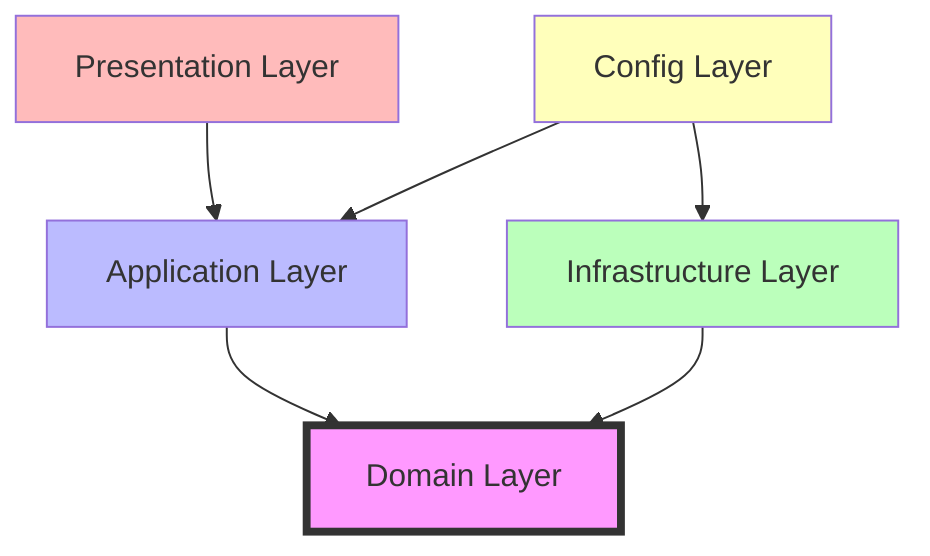

# Package Structure Design

**Role**: java-spring-architect
**Timestamp**: 2026-03-30T20:32:00Z
**Related Story**: STORY-002
**Status**: Complete

---

## Overview

Complete Java package structure following clean architecture principles with clear separation of concerns.

---

## Top-Level Package Structure

```
com.workmanagement/
├── domain/              # Core business logic (no framework dependencies)
├── application/         # Use case orchestration
├── infrastructure/      # Technical implementations
├── presentation/        # Controllers, DTOs
└── config/             # Spring configuration
```

---

## Detailed Package Structure

```
src/main/java/com/workmanagement/

├── domain/
│   ├── model/
│   │   ├── Story.java
│   │   ├── Task.java
│   │   ├── Artifact.java
│   │   ├── Comment.java
│   │   └── WorkspaceConfig.java
│   │
│   ├── value/
│   │   ├── StoryId.java
│   │   ├── TaskId.java
│   │   ├── ArtifactName.java
│   │   ├── CommentId.java
│   │   └── RoleName.java
│   │
│   ├── enums/
│   │   ├── WorkflowState.java
│   │   ├── PrioritizationState.java
│   │   ├── TaskState.java
│   │   ├── Role.java
│   │   ├── CommentType.java
│   │   ├── ArtifactType.java
│   │   └── FileFormat.java
│   │
│   ├── service/
│   │   ├── StateTransitionService.java
│   │   └── DirectoryLocationResolver.java
│   │
│   ├── repository/
│   │   ├── StoryRepository.java
│   │   ├── TaskRepository.java
│   │   ├── ArtifactRepository.java
│   │   ├── CommentRepository.java
│   │   └── WorkspaceRepository.java
│   │
│   └── exception/
│       ├── InvalidTransitionException.java
│       ├── ValidationException.java
│       ├── StoryNotFoundException.java
│       ├── TaskNotFoundException.java
│       └── WorkspaceException.java
│
├── application/
│   ├── story/
│   │   ├── StoryService.java
│   │   ├── StoryServiceImpl.java
│   │   ├── CreateStoryCommand.java
│   │   ├── UpdateStoryCommand.java
│   │   └── TransitionStateCommand.java
│   │
│   ├── task/
│   │   ├── TaskService.java
│   │   ├── TaskServiceImpl.java
│   │   ├── CreateTaskCommand.java
│   │   └── UpdateTaskCommand.java
│   │
│   ├── artifact/
│   │   ├── ArtifactService.java
│   │   ├── ArtifactServiceImpl.java
│   │   └── CreateArtifactCommand.java
│   │
│   ├── comment/
│   │   ├── CommentService.java
│   │   ├── CommentServiceImpl.java
│   │   └── CreateCommentCommand.java
│   │
│   ├── workspace/
│   │   ├── WorkspaceService.java
│   │   ├── WorkspaceServiceImpl.java
│   │   ├── InitializeWorkspaceCommand.java
│   │   └── ValidateWorkspaceCommand.java
│   │
│   └── validation/
│       ├── ValidationService.java
│       └── ValidationServiceImpl.java
│
├── infrastructure/
│   ├── filesystem/
│   │   ├── FileSystemStoryRepository.java
│   │   ├── FileSystemTaskRepository.java
│   │   ├── FileSystemArtifactRepository.java
│   │   ├── FileSystemCommentRepository.java
│   │   ├── FileSystemWorkspaceRepository.java
│   │   └── PathResolver.java
│   │
│   ├── validation/
│   │   ├── StoryValidator.java
│   │   ├── TaskValidator.java
│   │   ├── ArtifactNameValidator.java
│   │   ├── DirectoryNameValidator.java
│   │   └── MetadataValidator.java
│   │
│   ├── logging/
│   │   ├── ActivityLogger.java
│   │   ├── ActivityLoggerImpl.java
│   │   ├── JSONLinesWriter.java
│   │   └── LogEntryBuilder.java
│   │
│   └── template/
│       ├── TemplateService.java
│       ├── StoryTemplateGenerator.java
│       ├── TaskTemplateGenerator.java
│       └── ArtifactTemplateGenerator.java
│
├── presentation/
│   ├── rest/
│   │   ├── StoryController.java
│   │   ├── TaskController.java
│   │   ├── WorkspaceController.java
│   │   └── ArtifactController.java
│   │
│   ├── dto/
│   │   ├── StoryDTO.java
│   │   ├── TaskDTO.java
│   │   ├── CreateStoryRequest.java
│   │   ├── CreateTaskRequest.java
│   │   └── ErrorResponse.java
│   │
│   └── exception/
│       └── GlobalExceptionHandler.java
│
└── config/
    ├── WorkspaceConfiguration.java
    ├── LoggingConfiguration.java
    ├── ValidationConfiguration.java
    └── WebConfiguration.java
```

---

## Package Dependency Rules



**Rules**:
1. Domain layer has NO dependencies on other layers
2. Application layer depends ONLY on domain
3. Infrastructure implements domain interfaces
4. Presentation depends on application (not domain directly)
5. Config wires everything together

---

## Layer Responsibilities

### Domain Layer (Pure Java)
- **NO Spring annotations** (except in service/ for interfaces)
- Contains business rules and invariants
- Defines repository interfaces
- Contains all enums and value objects
- Pure Java entities with behavior

### Application Layer
- @Service annotations
- Use case orchestration
- Transaction boundaries (@Transactional)
- Command pattern for inputs
- Depends only on domain

### Infrastructure Layer
- @Repository, @Component annotations
- Implements domain repository interfaces
- File I/O operations
- Logging implementation
- Template generation
- External system integration

### Presentation Layer
- @RestController annotations
- DTOs for request/response
- Input validation (@Valid)
- Exception handling (@ControllerAdvice)
- Maps between DTOs and domain models

### Config Layer
- @Configuration classes
- @ConfigurationProperties
- Bean definitions
- Application wiring

---

## Naming Conventions

| Type | Convention | Example |
|------|-----------|---------|
| **Entities** | PascalCase noun | Story, Task, Artifact |
| **Value Objects** | PascalCase + "Id" or descriptive | StoryId, ArtifactName |
| **Enums** | PascalCase | WorkflowState, Role |
| **Interfaces** | PascalCase + descriptive | StoryRepository, StoryService |
| **Implementations** | Interface + "Impl" | StoryServiceImpl, FileSystemStoryRepository |
| **Commands** | Verb + Noun + "Command" | CreateStoryCommand |
| **DTOs** | Noun + "DTO" or "Request/Response" | StoryDTO, CreateStoryRequest |
| **Exceptions** | Noun + "Exception" | InvalidTransitionException |

---

## Test Package Structure

```
src/test/java/com/workmanagement/

├── domain/
│   ├── model/
│   │   ├── StoryTest.java
│   │   └── TaskTest.java
│   ├── value/
│   │   ├── StoryIdTest.java
│   │   └── ArtifactNameTest.java
│   └── enums/
│       └── WorkflowStateTest.java
│
├── application/
│   ├── story/
│   │   └── StoryServiceImplTest.java
│   └── task/
│       └── TaskServiceImplTest.java
│
├── infrastructure/
│   ├── filesystem/
│   │   ├── FileSystemStoryRepositoryTest.java
│   │   └── FileSystemTaskRepositoryTest.java
│   └── validation/
│       └── StoryValidatorTest.java
│
└── presentation/
    └── rest/
        └── StoryControllerTest.java
```

---

## Maven/Gradle Module Structure (Optional Future)

For larger projects, can split into modules:

```
work-management/
├── work-management-domain/        # Pure domain module
├── work-management-application/   # Application services
├── work-management-infrastructure/ # File I/O, logging
├── work-management-web/           # REST controllers
└── work-management-boot/          # Spring Boot starter
```

**Phase 1**: Start with single module, split later if needed.

---

## Acceptance Criteria Verification

- ✅ Clear separation of concerns (4 distinct layers)
- ✅ Dependencies point inward (presentation → application → domain)
- ✅ Package structure documented (this file)
- ✅ No cyclic dependencies (enforced by layer rules)
- ✅ Follows Spring Boot conventions (@Service, @Repository, @RestController)

---

## Next Steps

1. Use this structure for STORY-012 (Spring Boot Project Setup)
2. Create packages in IDE
3. Implement classes following this structure
4. Enforce package dependencies with ArchUnit tests (optional)