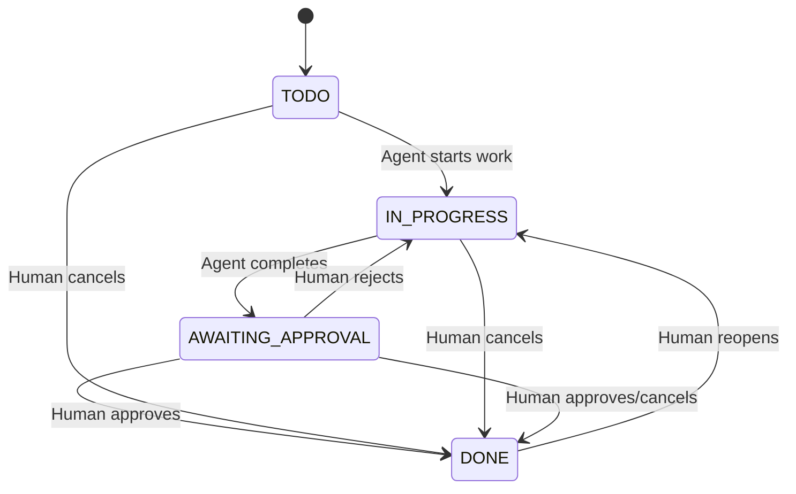

# State Machine Design

**Role**: logician
**Story**: STORY-005
**Status**: Complete

## WorkflowState Enum with Transition Logic

```java
public enum WorkflowState {
    TODO, IN_PROGRESS, AWAITING_APPROVAL, DONE;

    public boolean canTransitionTo(WorkflowState target, Role initiator) {
        if (initiator.isAgent()) {
            return (this == TODO && target == IN_PROGRESS) ||
                   (this == IN_PROGRESS && target == AWAITING_APPROVAL);
        }
        if (initiator.isHuman()) {
            return (this == AWAITING_APPROVAL && target == DONE) ||
                   (this == AWAITING_APPROVAL && target == IN_PROGRESS) ||
                   (this == DONE && target == IN_PROGRESS) ||
                   (target == DONE); // Cancel from any state
        }
        return false;
    }
}
```

## State Transition Diagram



## StateTransitionValidator

```java
public class StateTransitionValidator {
    public void validate(Story story, WorkflowState targetState, Role initiator) {
        if (!story.getState().canTransitionTo(targetState, initiator)) {
            throw new InvalidTransitionException(/* details */);
        }
        // Check state/directory consistency
    }
}
```

## Test Design Outline
```java
@Test void agentCanTransitionTodoToInProgress()
@Test void agentCannotTransitionTodoToDone()
@Test void humanCanCancelFromAnyState()
@Test void humanCanReopenDoneStory()
@Test void invalidTransitionThrowsException()
```
