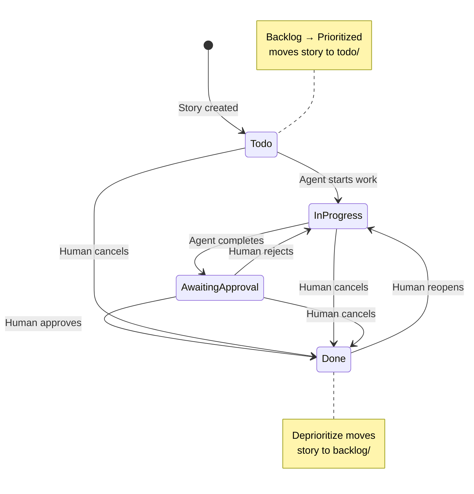

# AI Work Management Platform - Refined Requirements

**Document Version**: 1.0
**Date**: 2026-03-30
**Status**: Implementation Ready - All Concerns Resolved

---

## Executive Summary

Build a **Java Spring Boot application** that orchestrates AI-driven work item management using an **external filesystem workspace** as the authoritative system of record.

**Key Characteristics**:
- Story-centric workflow (similar to Jira/Scrum)
- Two orthogonal state dimensions: Prioritization (backlog/prioritized) + Workflow (todo/in-progress/awaiting-approval/done)
- Multi-agent collaboration via append-only artifacts and comments
- Single authoritative role (orchestrator) for work item modifications
- All file types supported for artifacts (not just markdown)
- Role-based file naming (not LLM-based)
- Structured JSON logging per role per day

---

## Core Architecture

### Dual-Component System

| Component | Purpose | Technology |
|-----------|---------|------------|
| **Core Project** | Workflow logic, validation, orchestration services | Java Spring Boot |
| **Managed Workspace** | Authoritative storage for work items, artifacts | External filesystem |

**Critical Rule**: Managed workspace is **external** to core project repository

---

## Workspace Structure

### Directory Layout

```
<workspace-root>/
  work-items/
    backlog/                    # Backlog stories (any workflow state)
      STORY-123-feature-x/
    prioritized/                # (deprecated - stories go in workflow dirs)
    todo/                       # Prioritized stories ready for work
      STORY-456-feature-y/
    in-progress/                # Prioritized stories being worked
      STORY-789-feature-z/
    awaiting-approval/          # Prioritized stories awaiting review
    done/                       # Completed stories

  reference/
    technical/                  # Technical reference docs
    human-facing/              # User-facing docs
    media/                     # Media assets

  agents/
    logs/                      # Role-based activity logs
      orchestrator__2026-03-30.log
      tester__2026-03-30.log
    memory/                    # Long-lived agent memory

  templates/                   # Template files
    story-template.md
    task-template.md
    artifact-template.md
```

---

## State Model (Orthogonal Dimensions)

### Directory Organization Rules

**Backlog Directory**:
- Contains ALL backlog stories regardless of workflow state
- Flat structure (all stories at same level)
- Stories have `prioritization: backlog` in metadata
- Stories have `state: <workflow-state>` in metadata

**Workflow Directories** (todo/, in-progress/, awaiting-approval/, done/):
- Contain ONLY prioritized stories
- Directory location indicates current workflow state
- Stories have `prioritization: prioritized` in metadata
- Stories have `state` field matching directory name

**Example**:
```
work-items/
  backlog/
    STORY-001/  # prioritization: backlog, state: todo
    STORY-002/  # prioritization: backlog, state: in-progress (awaiting prioritization)

  in-progress/
    STORY-123/  # prioritization: prioritized, state: in-progress
```

### Workflow State Transitions



**Transition Rules**:

| From | To | Initiator | Valid? |
|------|-----|-----------|--------|
| todo | in-progress | Agent | ✅ Yes |
| in-progress | awaiting-approval | Agent | ✅ Yes |
| awaiting-approval | done | Human | ✅ Yes (approve) |
| awaiting-approval | in-progress | Human | ✅ Yes (reject) |
| done | in-progress | Human | ✅ Yes (reopen) |
| any | done | Human | ✅ Yes (cancel) |
| todo | done | Agent | ❌ No |
| in-progress | done | Agent | ❌ No |
| in-progress | todo | Agent | ❌ No |

**Prioritization Transitions**:

| From | To | Initiator | Action |
|------|-----|-----------|---------|
| backlog | prioritized | Human | Move from backlog/ to todo/ |
| prioritized | backlog | Human | Move from workflow dir to backlog/ |

---

## Work Item Structure

### Story Directory

```
STORY-<id>-<slug>/
  story.md                      # Authoritative (orchestrator only)
  artifacts/                    # Agent outputs (all file types)
    api-research__researcher__2026-03-30T140512Z.md
    dashboard-mockup__designer__2026-03-30T141230Z.png
    test-results__tester__2026-03-30T142030Z.pdf
  comments/                     # Agent collaboration
    comment__designer__2026-03-30T141315Z.md
    comment__tester__2026-03-30T142045Z.md
  tasks/                        # Optional sub-work
    TASK-001-chart-component/
      task.md
      artifacts/
```

**Naming Rules**:
- Story directory: `STORY-<id>-<slug>/` (uppercase STORY, lowercase kebab-case slug)
- Task directory: `TASK-<id>-<slug>/` (uppercase TASK, lowercase kebab-case slug)
- Artifact files: `<descriptive-name>__<role>__<timestamp>.<ext>`
- Comment files: `comment__<role>__<timestamp>.md`

---

## File Contracts

### story.md Contract

**Required YAML Frontmatter**:
```yaml
---
id: STORY-123
type: story
title: Dashboard UI Redesign                    # REQUIRED
state: in-progress                              # Workflow state
prioritization: prioritized                     # backlog | prioritized
author: john.doe                                # Human curator
summary: Build responsive dashboard UI
acceptance_criteria:
  - Dashboard displays last 30 days of activity
  - Charts are interactive and responsive
  - Loading states implemented
  - Error states handled gracefully
created_at: 2026-03-30T10:00:00Z
updated_at: 2026-03-30T14:30:00Z
---
```

**Required Fields**:
- `id`, `type`, `title`, `state`, `prioritization`, `author`, `summary`, `acceptance_criteria`

**Optional Fields**:
- `priority`, `parent_epic`, `created_at`, `updated_at`, `tags`, `references`, `artifact_path`, `task_count`

**Modification Authority**:
- **ONLY** the `orchestrator` role can modify story.md
- All other roles must provide updates via comments/

---

### task.md Contract

**Required YAML Frontmatter**:
```yaml
---
id: TASK-001
type: task
title: Implement chart component                # REQUIRED
parent_story: STORY-123
state: in-progress                              # pending | in-progress | completed
author: john.doe
objective: Create reusable chart component
completion_criteria:
  - Component accepts time-series data
  - Component is responsive
  - Component has unit tests
created_at: 2026-03-30T11:00:00Z
---
```

**Required Fields**:
- `id`, `type`, `title`, `parent_story`, `state`, `author`, `objective`, `completion_criteria`

---

### Comment File Contract

**Format**: Markdown with YAML frontmatter

```yaml
---
comment_type: status_update | question | suggestion | artifact_reference
agent: designer                                 # ROLE name (not LLM)
timestamp: 2026-03-30T14:13:15Z
related_story: STORY-123
related_task: TASK-001                          # Optional
---
## Comment Title

Comment body goes here. Agents use comments to provide updates
without directly modifying story.md.

References to artifacts can be included.
```

**Comment Types**:
- `status_update`: Progress updates
- `question`: Requests for clarification
- `suggestion`: Recommendations or proposals
- `artifact_reference`: Links to created artifacts

---

### Artifact File Naming

**Pattern**:
```
<descriptive-name>__<role>__<yyyy-mm-ddThhmmssZ>.<ext>
```

**Three Required Elements** (separated by double underscores):
1. **Descriptive name**: Human-readable (kebab-case)
2. **Role name**: Role that created it (not LLM name)
3. **Timestamp**: ISO 8601 UTC

**Examples by File Type**:

| Type | Example |
|------|---------|
| Markdown | `api-research__researcher__2026-03-30T140512Z.md` |
| Image | `dashboard-mockup__designer__2026-03-30T141230Z.png` |
| PDF | `test-results__tester__2026-03-30T142030Z.pdf` |
| SVG | `architecture-diagram__logician__2026-03-30T140615Z.svg` |
| Video | `demo-recording__tester__2026-03-30T143000Z.mp4` |
| Java | `StateValidator__logician__2026-03-30T144500Z.java` |

**Rules**:
- ✅ All file types supported (not limited to markdown)
- ✅ Append-only (never overwrite)
- ✅ Immutable after creation
- ✅ Must be referenced in agent logs
- ✅ Must be recorded in story comments when created

---

## Role-Based Authority Model

### Role Definitions

All roles are defined in `.agent/roles/<role-name>/ROLE.md`

| Role | Can Modify story.md? | Can Create Stories? | Can Transition States? | Primary Responsibility |
|------|---------------------|---------------------|------------------------|------------------------|
| **orchestrator** | ✅ Yes (ONLY) | ✅ Yes | ✅ Yes | Workflow coordination |
| **designer** | ❌ No | ❌ No | ❌ No | UX/UI design |
| **logician** | ❌ No | ❌ No | ❌ No | Algorithms, Java code |
| **creative-writer** | ❌ No | ❌ No | ❌ No | Creative content |
| **artist** | ❌ No | ❌ No | ❌ No | Image generation |
| **tester** | ❌ No | ❌ No | ❌ No | Testing, QA |
| **reviewer** | ❌ No | ❌ No | ❌ No | Code/design review |
| **researcher** | ❌ No | ❌ No | ❌ No | Research, analysis |

**Authority Principle**: Only the `orchestrator` role can modify authoritative files (story.md, task.md)

---

## Agent Logging Specification

### Log File Format

**File Naming**:
```
agents/logs/<role-name>__<yyyy-mm-dd>.log
```

One log file per role per day.

**Format**: JSON Lines (one JSON object per line)

**Example Log File**:
```json
{"timestamp":"2026-03-30T14:05:12Z","role":"orchestrator","activity":"story_created","story_id":"STORY-123","details":{"title":"Dashboard redesign","state":"todo","prioritization":"backlog"},"outcome":"success"}
{"timestamp":"2026-03-30T14:06:45Z","role":"designer","activity":"work_started","story_id":"STORY-123","details":{"assigned_by":"orchestrator"},"outcome":"success"}
{"timestamp":"2026-03-30T14:12:30Z","role":"designer","activity":"artifact_created","story_id":"STORY-123","details":{"artifact":"dashboard-mockup__designer__2026-03-30T141230Z.png","type":"mockup"},"outcome":"success"}
{"timestamp":"2026-03-30T14:13:15Z","role":"designer","activity":"comment_created","story_id":"STORY-123","details":{"comment":"comment__designer__2026-03-30T141315Z.md"},"outcome":"success"}
{"timestamp":"2026-03-30T14:15:00Z","role":"designer","activity":"work_completed","story_id":"STORY-123","details":{"artifacts_created":1,"comments_created":1},"outcome":"success"}
```

### Log Entry Schema

**Required Fields**:

| Field | Type | Description |
|-------|------|-------------|
| `timestamp` | ISO 8601 | When activity occurred (UTC) |
| `role` | String | Role performing activity (not LLM) |
| `activity` | String | Activity type (see below) |
| `outcome` | Enum | `success` \| `failure` \| `partial` |

**Optional Fields**:

| Field | Type | Description |
|-------|------|-------------|
| `story_id` | String | Story ID if applicable |
| `task_id` | String | Task ID if applicable |
| `details` | Object | Activity-specific details |
| `error` | String | Error message if outcome=failure |

### Standard Activity Types

| Activity | When to Log |
|----------|-------------|
| `story_created` | Story created |
| `story_updated` | Story metadata modified |
| `task_created` | Task created |
| `task_updated` | Task metadata modified |
| `work_started` | Role begins work on story/task |
| `work_completed` | Role finishes work |
| `artifact_created` | Artifact file written |
| `comment_created` | Comment file written |
| `state_transition` | Workflow state changed |
| `prioritization_changed` | Backlog ↔ Prioritized |
| `human_interaction` | Human provided input |
| `role_delegated` | Work delegated to another role |
| `validation_performed` | Validation check run |
| `error_occurred` | Error during operation |

---

## Implementation Phases

### Phase 1: Workspace Foundation
**Deliverables**:
- Workspace configuration model (Java)
- Workspace initializer service
- Workspace structure validator
- Path resolution utilities
- Naming convention validators

**Acceptance Criteria**:
- Can initialize valid external workspace
- Can validate workspace structure
- Can detect and report violations
- Can resolve paths to stories/tasks/artifacts

---

### Phase 2: Work Item Management
**Deliverables**:
- Story creation service
- Task creation service
- Story/task metadata readers
- Story/task metadata update service
- Story state transition service
- State consistency validator

**Acceptance Criteria**:
- Can create story with valid story.md, artifacts/, comments/
- Can create task under story with valid task.md
- Can transition stories between all valid states
- Can validate state field matches directory location
- Enforces transition rules (agent vs human)

---

### Phase 3: Artifact & Comment Management
**Deliverables**:
- Artifact creation service
- Comment creation service
- Artifact naming validator
- Artifact listing service
- Comment parser

**Acceptance Criteria**:
- Can create append-only artifacts with required naming
- Can create comment files with proper metadata
- Can list artifacts by story/task
- Supports all file types (not just markdown)
- Validates artifact naming pattern

---

### Phase 4: Role-Based Logging
**Deliverables**:
- JSON Lines logger service
- Activity type enum
- Log entry builder
- Log file rotation (daily)
- Log query utilities

**Acceptance Criteria**:
- Writes JSON Lines format
- One log file per role per day
- Logs all required activities
- Includes all required fields
- Queryable log data

---

### Phase 5: Multi-Agent Coordination
**Deliverables**:
- Concurrent artifact write safety
- Comment-based collaboration
- Orchestrator delegation API
- Human approval workflows
- Reference promotion service

**Acceptance Criteria**:
- Multiple roles can write artifacts concurrently without conflicts
- Orchestrator can curate comments into story.md
- Humans can approve/reject/cancel via orchestrator
- Can promote artifacts to reference/
- Maintains audit trail in logs

---

## Acceptance Criteria (Complete)

The implementation is acceptable when it can:

1. ✅ Initialize a valid external workspace with all required directories
2. ✅ Create story directory with story.md, artifacts/, and comments/
3. ✅ Create task under story with valid task.md
4. ✅ Transition stories between all valid states (prioritize, deprioritize, workflow transitions)
5. ✅ Keep story.md state fields consistent with directory location
6. ✅ Create append-only artifacts with naming: `<desc>__<role>__<timestamp>`
7. ✅ Allow multiple roles to write artifacts concurrently without overwrites
8. ✅ Distinguish authoritative (story.md, task.md) vs non-authoritative (artifacts/, comments/) content
9. ✅ Promote approved content into reference/
10. ✅ Keep agent logs and memory separate from work item artifacts
11. ✅ Update story workflow state based on agent work (todo → in-progress → awaiting-approval)
12. ✅ Update stories based on human input (approve, reject, cancel, reopen)
13. ✅ Log all activities to role-specific daily log files in JSON Lines format
14. ✅ Enforce orchestrator-only modification of story.md and task.md
15. ✅ Support all file types for artifacts (images, PDFs, videos, code, etc.)

---

## Non-Negotiable Constraints

- ❗ Managed workspace MUST be external to core project repository
- ❗ Stories are the primary unit of work and movement
- ❗ Tasks are optional and nested under stories
- ❗ story.md and task.md are authoritative
- ❗ ONLY orchestrator role can modify story.md and task.md
- ❗ Artifacts are append-only and immutable
- ❗ Every artifact filename MUST include role identity and UTC timestamp
- ❗ File naming uses ROLE names, never LLM names
- ❗ reference/ contains ONLY approved stable content
- ❗ agents/ is NOT a work item source-of-truth area
- ❗ Use `author` field, never `owner`
- ❗ Implementation must remain generic across managed projects
- ❗ All agent activities MUST be logged in JSON Lines format

---

## Technology Stack

| Component | Technology |
|-----------|------------|
| Application Framework | Java Spring Boot |
| Work Item Storage | External filesystem (markdown + YAML frontmatter) |
| Artifact Storage | External filesystem (all file types) |
| Logging Format | JSON Lines |
| Configuration | YAML |
| Validation | Bean Validation, custom domain validators |
| Testing | JUnit, AssertJ, Mockito |

---

## Next Steps

1. ✅ Requirements refined and approved
2. ⏭️ Create domain model design (use `java-spring-architect` skill)
3. ⏭️ Create markdown templates (use `markdown-template-designer` skill)
4. ⏭️ Design package structure
5. ⏭️ Implement Phase 1: Workspace Foundation
6. ⏭️ Implement Phase 2: Work Item Management
7. ⏭️ Implement Phase 3: Artifact & Comment Management
8. ⏭️ Implement Phase 4: Role-Based Logging
9. ⏭️ Implement Phase 5: Multi-Agent Coordination

---

**Document Approval**:
- Requirements Manager: ✅ Approved
- All blocker concerns resolved: ✅ Yes
- Implementation ready: ✅ Yes